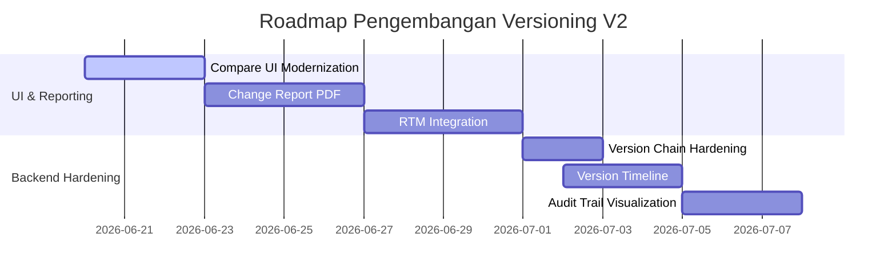

# AUDIT & DESAIN: DOCUMENT CHANGE REPORT (AUDITOR MODE)
**Project:** Library-ISO — PT Peroni Karya Sentra  
**Date of Audit:** June 19, 2026  
**Auditor:** Antigravity (Advanced Agentic Coding AI)

---

## PHASE 1 — FORENSIC ANALYSIS

Analisis kelayakan teknis untuk pembuatan fitur **Document Change Report** formal sebagai bukti audit ISO 9001:2015:

### 1. Data yang Sudah Tersedia
* **Metadata Dokumen Utama:** Kode dokumen (`doc_code`), Judul (`title`), Departemen (`department`), Tanggal Berlaku (`revision_date`).
* **Metadata Versi Dokumen:** Kolom `version_label`, `status`, `created_at`, dan data pengunggah (`creator_id`).
* **Konten Teks Histori:** Kolom `plain_text` dan `pasted_text` tersimpan rapi untuk setiap baris `document_versions`.
* **Mesin Perbandingan:** Library `jfcherng/php-diff` sudah terkonfigurasi dan mampu menghasilkan keluaran HTML diff ter-highlight.

### 2. Data yang Kurang / Keterbatasan Saat Ini
* **Catatan Revisi (`change_note` / `summary_changed`):** Kolom deskripsi alasan revisi ada pada model `DocumentVersion`, namun pada beberapa unggahan bersejarah kolom ini kosong atau diisi default (`Extracted from PDF`). Hal ini mengurangi kejelasan alasan perubahan bagi auditor.
* **Log Persetujuan Formal (`approved_by`):** Model `DocumentVersion` tidak menyimpan secara langsung siapa penyetuju versi tersebut. Relasi harus ditarik dari tabel `approval_logs` yang mencatat log persetujuan dari tingkat KABAG, MR, hingga Direktur.

### 3. Komponen Target Implementasi
* **Controller:** `DocumentController` (metode baru `generateChangeReport`). Sangat cocok karena sudah memegang kontrol atas visualisasi dokumen dan diff.
* **Route:** `/documents/{document}/change-report?v1={v1_id}&v2={v2_id}` (Name: `documents.change-report`), bertipe `GET`.
* **View:** `resources/views/documents/change_report.blade.php`. Menggunakan layout bersih khusus cetak.

### 4. Status PDF Generator di Proyek
* **Hasil Audit Dependencies:** Berdasarkan pemeriksaan `composer.json`, **tidak ada** library generator PDF (seperti `dompdf` / `laravel-dompdf`, `mpdf`, atau `wkhtmltopdf`) yang terinstal saat ini.
* **Solusi Pendekatan PDF:**
  1. **Pendekatan Server-Side (Dompdf):** Menginstal package `barryvdh/laravel-dompdf` via composer. Ini memungkinkan sistem menghasilkan file PDF mentah secara langsung di server dan otomatis terunduh oleh pengguna.
  2. **Pendekatan Client-Side (Print CSS Stylesheet):** Menggunakan HTML & CSS `@media print` murni. Layar didesain khusus agar saat tombol `CTRL+P` ditekan, browser merapikan halaman menjadi cetakan dokumen formal A4 (menyembunyikan navigasi web, mengoptimalkan jeda halaman / `page-break`, dan mengubah tombol menjadi format cetak). Ini sangat efisien dan bebas dependensi tambahan.

### 5. Risiko Performa pada Diff Skala Besar
* **Penyebab:** Dokumen ISO/SOP yang memiliki panjang ratusan halaman dengan puluhan ribu baris teks dapat menyebabkan konsumsi RAM PHP melonjak tajam saat kalkulasi diff dilakukan, bahkan berisiko memicu `Fatal Error: Allowed memory size exhausted` atau `Maximum execution time exceeded` terutama jika di-render ke PDF menggunakan Dompdf (yang memiliki konsumsi memori tinggi).
* **Strategi Mitigasi:**
  * Batasi pencetakan teks penuh untuk perubahan di atas 50.000 karakter. Jika terlampau besar, tampilkan peringatan dan hanya cetak bagian ringkasan (*Revision Summary* & *Executive Summary*).
  * Bersihkan whitespace berlebih sebelum teks dikirim ke diff engine untuk memperkecil ukuran data input.

---

## PHASE 2 — REPORT DESIGN (MOCKUP PRINT LAYOUT)

Format laporan dirancang untuk ramah cetak A4 dengan batas halaman yang rapi:

```text
+-------------------------------------------------------------------------------+
|                                                                               |
|                            PT PERONI KARYA SENTRA                             |
|                        SISTEM MANAJEMEN MUTU ISO 9001                         |
|                         DOKUMEN LAPORAN PERUBAHAN                             |
|                                                                               |
| ============================================================================= |
|                                                                               |
|  1. INFORMASI UMUM DOKUMEN                                                    |
|  ---------------------------------------------------------------------------  |
|  Kode Dokumen : IK.GUD-JPF.02             Departemen : Gudang Jadi Fitting    |
|  Judul Dokumen: PROSEDUR KERJA OPERATOR STEMPEL LASER                         |
|  Versi Aktif  : v3 (Approved)                                                 |
|                                                                               |
|  2. VERSI YANG DIBANDINGKAN                                                   |
|  ---------------------------------------------------------------------------  |
|  VERSI BASE (ACUAN AWAL)                   VERSI TARGET (PERUBAHAN BARU)      |
|  Versi      : v1                           Versi      : v3                    |
|  Status     : Approved                     Status     : Approved              |
|  Tgl Rilis  : 03 Dec 2025                  Tgl Rilis  : 19 Jun 2026           |
|  Disetujui  : Direktur                     Disetujui  : Direktur              |
|                                                                               |
|  3. RINGKASAN REVISI (CHANGE SUMMARY)                                         |
|  ---------------------------------------------------------------------------  |
|  [+] Jumlah Kata Ditambahkan  : 15 Kata                                       |
|  [-] Jumlah Kata Dihapus      : 4 Kata                                        |
|  [*] Total Perubahan          : 19 Perubahan Kata                             |
|                                                                               |
|  4. RINGKASAN EKSEKUTIF PERUBAHAN (EXECUTIVE SUMMARY)                         |
|  ---------------------------------------------------------------------------  |
|  Berikut adalah intisari klausul penting yang mengalami perubahan:            |
|  •  [TAMBAH] "... update stock melalui program ..."                           |
|  •  [TAMBAH] "... Memeriksa kondisi bahan baku secara visual ..."             |
|  •  [HAPUS]  "... Kabag. Gudang Bahan Baku ..."                               |
|                                                                               |
|  5. DETAIL PERUBAHAN DOKUMEN (CHANGE DETAILS)                                 |
|  ---------------------------------------------------------------------------  |
|  Line 2.9: Membuat "Bukti Penerimaan Barang (BPB)", berdasarkan bukti timbang |
|  dan surat jalan yang telah distempel [dan update stock melalui program].     |
|                                                                               |
|  Line 2.1: [Memeriksa kondisi bahan baku secara visual, meliputi :]           |
|                                                                               |
|  Penanggung Jawab: [- Kabag. Gudang Bahan Baku -] [+ Gudang Bahan Baku]       |
|                                                                               |
|  ---------------------------------------------------------------------------  |
|  Laporan ini dihasilkan secara otomatis oleh sistem Library-ISO               |
|  Dicetak oleh : Budi QA (QA Staff)                                            |
|  Tanggal Cetak: 19 Juni 2026, 15:32 WIB                                       |
|                                                                               |
+-------------------------------------------------------------------------------+
```

---

## PHASE 3 — EXECUTIVE SUMMARY GENERATOR (NON-AI APPROACH)

### Kelayakan Implementasi Murni PHP
Menyajikan ringkasan eksekutif secara dinamis tanpa bantuan API AI sangat realistis dan andal menggunakan analisis tag HTML diff.

#### Algoritma Ekstraksi Kalimat Perubahan:
1. Ambil output HTML diff dari `php-diff`.
2. Gunakan Regular Expression (`preg_match_all`) untuk menangkap semua fragmen teks yang berada di dalam tag `<ins>` (penambahan) dan `<del>` (penghapusan).
   * Regulasi Penambahan: `/<ins>(.*?)<\/ins>/s`
   * Regulasi Penghapusan: `/<del>(.*?)<\/del>/s`
3. Bersihkan fragmen teks tersebut dari tag HTML sisa dan karakter aneh.
4. Saring frasa yang memiliki panjang kurang dari 4 karakter (misalnya spasi, titik, koma) agar ringkasan hanya menampilkan kata kunci atau kalimat yang bermakna.
5. Batasi jumlah tampilan (maksimal 5 item penambahan dan 5 item penghapusan teratas) untuk diletakkan pada bagian *Executive Summary*.

---

## PHASE 4 — VERSION CHAIN AUDIT

Audit mendalam terhadap status kolom `prev_version_id` pada tabel `document_versions`:

### 1. Kapan field ini diisi?
* Field ini **hanya terisi** jika administrator menjalankan perintah CLI artisan secara manual di server terminal:
  ```bash
  php artisan documents:build-relations
  ```
  Perintah ini mencari seluruh versi dokumen, mengurutkannya berdasarkan `created_at` secara urutan menaik, lalu menuliskan ID versi sebelumnya ke kolom `prev_version_id`.

### 2. Kapan field ini kosong (NULL)?
* Saat dokumen baru diunggah lewat form web (`DocumentController@store` atau `DocumentVersionController@store`).
* Saat revisi dokumen baru diajukan lewat sistem persetujuan.
* Semua data historis yang diimpor tanpa melalui rebuild command.

### 3. Keamanan Penggunaan untuk Revisi Timeline
* **Tidak Aman saat ini.** Karena data runtime tidak mengisi kolom ini secara real-time, timeline revisi akan terputus (menampilkan null) untuk dokumen yang baru direvisi, sampai admin menjalankan kembali CLI command tersebut.

### 4. Strategi Perbaikan Teknis
Guna menjamin keutuhan rantai versi secara otomatis tanpa bergantung pada eksekusi manual CLI, direkomendasikan menerapkan **Laravel Model Observer**:

```php
namespace App\Observers;

use App\Models\DocumentVersion;

class DocumentVersionObserver
{
    public function creating(DocumentVersion $version)
    {
        // Temukan versi terakhir yang tercatat untuk dokumen yang sama
        $latestVersion = DocumentVersion::where('document_id', $version->document_id)
            ->orderByDesc('id')
            ->first();

        if ($latestVersion) {
            // Rantai versi disambungkan secara otomatis di runtime
            $version->prev_version_id = $latestVersion->id;
        }
    }
}
```
Daftarkan observer ini pada `App\Providers\EventServiceProvider` atau `AppServiceProvider`:
```php
DocumentVersion::observe(DocumentVersionObserver::class);
```
Dengan metode ini, setiap kali versi baru diunggah melalui alur web manapun, ia langsung mendeteksi pendahulunya dan menyambungkan linked-list tersebut seketika sebelum baris data tersimpan ke database.

---

## PHASE 5 — FUTURE ROADMAP & ESTIMATED EFFORT

Rencana prioritas pengerjaan pengembangan fitur versioning:



### Estimasi Usaha Pengembangan (Effort Estimation)

1. **Compare UI Modernization**
   * *Effort:* **Medium** (3 hari)
   * *Detail:* Pembenahan total tata letak blade view, penerapan CSS premium, dan pembuatan dashboard parameter.
2. **Change Report PDF**
   * *Effort:* **Medium** (4 hari)
   * *Detail:* Desain template cetak ramah A4, integrasi print stylesheet `@media print` atau instalasi Dompdf, serta pembuatan controller handler.
3. **Version Timeline**
   * *Effort:* **Low** (2-3 hari)
   * *Detail:* Pembuatan komponen visual linimasa pergerakan versi dari v1 ke vN di detail dokumen.
4. **Version Chain Hardening**
   * *Effort:* **Low** (1-2 hari)
   * *Detail:* Implementasi Laravel Model Observer untuk mengunci integritas `prev_version_id` secara real-time di database.
5. **Audit Trail Visualization**
   * *Effort:* **Medium** (3 hari)
   * *Detail:* Integrasi data approval log ke dalam visualisasi linimasa perubahan sehingga auditor mengetahui siapa pemeriksa dan penyetuju perubahan di tiap simpul.
6. **RTM Integration (Rapat Tinjauan Manajemen)**
   * *Effort:* **Medium** (4 hari)
   * *Detail:* Penghubungan langsung modul tinjauan manajemen agar dapat melampirkan Document Change Report secara otomatis sebagai lampiran notulen RTM.
