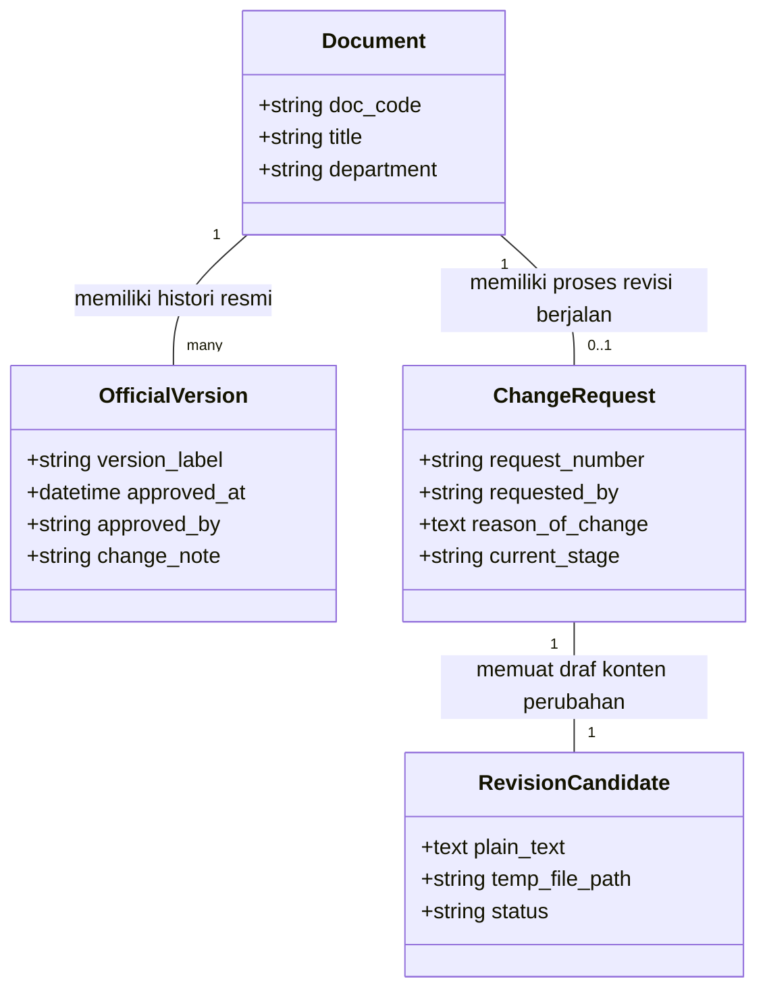

# ARCHITECTURAL REVIEW: QMS DOCUMENT CONTROL & CHANGE MANAGEMENT (V3)
**Project:** Library-ISO — PT Peroni Karya Sentra  
**Related Procedures:** PJM/MR/05 (Manajemen Perubahan) & FR/MR/06 (Permintaan Perubahan Dokumen)  
**Date:** June 19, 2026  
**Auditor:** Antigravity (Advanced Agentic Coding AI)

---

## 1. CURRENT STATE ARCHITECTURE (SISTEM SAAT INI)

Sistem saat ini menganut pola **Software Versioning (Git-Style)**, di mana setiap aktivitas perubahan atau draf baru langsung dibuatkan baris record baru di tabel `document_versions`.

```text
+---------------------------------------------------------------------------------+
|                                 TABEL: document_versions                        |
| +----+-------------+---------------+------------+------------------+----------+ |
| | ID | Document ID | Version Label | Status     | Path File        | Prev ID  | |
| +----+-------------+---------------+------------+------------------+----------+ |
| | 1  | 10 (IK.GUD) | v1            | approved   | docs/v1/file.pdf | NULL     | |
| | 2  | 10 (IK.GUD) | v2            | rejected   | docs/v2/file.pdf | 1        | |
| | 3  | 10 (IK.GUD) | v3            | rejected   | docs/v3/file.pdf | 2        | |
| | 4  | 10 (IK.GUD) | v4            | approved   | docs/v4/file.pdf | 3        | |
| +----+-------------+---------------+------------+------------------+----------+ |
+---------------------------------------------------------------------------------+
```
* **Kelemahan Model Ini:** 
  * `v2` dan `v3` adalah produk draf gagal (ditolak), namun tetap terekam sebagai simpul versi independen di database.
  * Menghasilkan label versi resmi fiktif (`v2`, `v3` tidak pernah diterbitkan secara hukum, langsung melompat dari `v1` ke `v4`).
  * Menyalahi asas kejelasan audit ISO karena melahirkan "lubang versi" (version gap).

---

## 2. ISO COMPLIANCE GAP ANALYSIS

Berdasarkan audit terhadap klausul **ISO 9001:2015 - Clause 7.5.3 (Control of Documented Information)** dan prosedur perusahaan (`PJM/MR/05` & `FR/MR/06`):

| Proses Bisnis ISO (Riil) | Kondisi Sistem Saat Ini | Status Gap | Rekomendasi Perbaikan |
| :--- | :--- | :--- | :--- |
| **Change Request (Permintaan Perubahan)** | Tidak ada konsep Change Request. Pengguna langsung mengunggah file revisi baru. | **Kritis** | Buat entitas *Change Request* (FR/MR/06) sebagai pembungkus draf revisi. |
| **Single Active Candidate** | Sistem membiarkan pengguna membuat banyak draf/proses revisi bertumpuk. | **Kritis** | Batasi maksimal hanya ada **1 draf revisi aktif** per dokumen. |
| **In-Place Draft Update** | Penolakan oleh Direktur melahirkan baris versi baru di DB saat diajukan kembali. | **Kritis** | Jika ditolak, draf yang sama diperbaiki (*updated in-place*) dan diajukan ulang. |
| **Clean Official Timeline** | Database menampung draf mentah dan rejected di tabel utama versi dokumen. | **Sedang** | Filter ketat tampilan linimasa agar hanya memuat versi sah (`approved`, `superseded`). |

---

## 3. CONCEPTUAL CLARIFICATION (PERBEDAAN ENTITAS)

Untuk menyelaraskan sistem dengan standar manajemen mutu, kita harus memisahkan empat konsep berikut secara mutlak:



1. **Official Version (Arsip Dokumen Terkendali):**
   * *Status:* Hanya `approved` (sedang berlaku) dan `superseded` (pernah berlaku).
   * *Label:* Menggunakan penomoran resmi (misal: `Rev 00`, `Rev 01`).
   * *Sifat:* Permanen, tidak boleh diedit atau dihapus. Menjadi subjek audit eksternal.
2. **Revision Candidate (Workspace Draf):**
   * *Status:* `draft`, `submitted`, `rejected`.
   * *Sifat:* Bersifat temporer/sementara. Hanya boleh ada **maksimal satu** candidate aktif per dokumen. Jika ditolak, data candidate ditimpa (di-update) oleh inisiator tanpa menambah baris versi baru.
3. **Change Request (FR/MR/06 - Formulir Perubahan):**
   * *Definisi:* Dokumen pengantar berisi justifikasi hukum perubahan dokumen.
   * *Meta:* Nomor CR (misal: `CR-001/GUD/2026`), Alasan Perubahan, Tanggal Pengajuan, Inisiator.
4. **Approval Workflow (Siklus Hidup):**
   * *Definisi:* State machine perpindahan status draf dari `Draft` ──► `Submitted (Kabag)` ──► `MR Review` ──► `Director Review` ──► `Approved`.

---

## 4. COMPARE ENGINE IMPACT ANALYSIS

Sistem komparasi wajib beroperasi dalam dua mode fungsional yang berbeda berdasarkan target penggunaannya:

### MODE A: Approval Compare (Pra-Persetujuan)
* **Tujuan:** Digunakan oleh MR dan Direktur untuk menilai kelayakan revisi.
* **Target Komparasi:** **Official Version Teraktif saat ini** vs **Revision Candidate (Draft)**.
* **Rumusan Data:** `v1 (Approved)` vs `v2 (Draft Candidate)`.

### MODE B: Historical Compare (Pasca-Persetujuan / Audit)
* **Tujuan:** Digunakan oleh Auditor Eksternal saat pelaksanaan surveillance audit mutu.
* **Target Komparasi:** **Official Version** vs **Official Version**.
* **Rumusan Data:** `v1 (Superseded)` vs `v2 (Approved)`.

---

## 5. RECOMMENDED FUTURE DATABASE MODEL

Untuk menerapkan model Change Request tanpa merombak total tabel `document_versions` (menghindari migrasi data legacy yang masif), kita dapat menerapkan pola **Logical Isolation with Unified Table** menggunakan schema berikut:

### A. Tabel Utama: `documents` (Existing - Tetap)
* Menyimpan `current_version_id` (menunjuk ke `document_versions.id` yang statusnya approved).

### B. Tabel: `document_change_requests` (New Table - FR/MR/06)
Tabel ini bertindak sebagai pengantar approval dan pembatas agar hanya ada satu draf revisi aktif.
```sql
CREATE TABLE document_change_requests (
    id BIGINT AUTO_INCREMENT PRIMARY KEY,
    document_id FOREIGN KEY REFERENCES documents(id),
    document_version_id FOREIGN KEY REFERENCES document_versions(id), -- Menunjuk ke draft candidate
    request_number VARCHAR(50) UNIQUE, -- Contoh: CR-001/QA/2026
    proposed_by FOREIGN KEY REFERENCES users(id),
    reason_of_change TEXT, -- Alasan perubahan (FR/MR/06)
    status ENUM('draft', 'submitted', 'rejected', 'approved') DEFAULT 'draft',
    approval_stage ENUM('KABAG', 'MR', 'DIRECTOR', 'DONE') DEFAULT 'KABAG',
    created_at TIMESTAMP,
    updated_at TIMESTAMP
);
```

### C. Tabel: `document_versions` (Existing - Modifikasi Logika)
Tabel ini tetap menampung data teks/file, namun dikunci dengan aturan:
* Jika dokumen berstatus draft revisi, record versi tersebut diasosiasikan ke `document_change_requests`.
* Jika Direktur menolak (`rejected`), data teks/file pada record yang sama **di-overwrite** (di-update) ketika pengguna mengunggah revisi perbaikan, bukan membuat baris baru.

---

## 6. UI & COMPARE PLACEMENT REDESIGN

### A. UI Halaman `documents.show` (Detail Dokumen)
* **Hanya menampilkan PDF dan detail metadata dari Official Version aktif.**
* Di bawah preview dokumen, terdapat tab:
  * **Tab 1: Official Version History:** Menampilkan visual timeline horizontal berisi versi yang `approved` dan `superseded`.
  * **Tab 2: Change Request History (Audit Trail):** Menampilkan riwayat CR (misal: `CR-001/QA/2026 - Approved`, `CR-002/QA/2026 - Rejected`).
  * **Tab 3: Active Change Request (Workspace):** Hanya muncul jika ada CR aktif (status `draft` / `submitted`). Di sinilah tombol `[Compare Candidate vs Active Version]` disajikan.

### B. UI Halaman `approvals.show` (Review MR/Director)
* Layar approval langsung menampilkan data formulir `Change Request` (Alasan Perubahan), Ringkasan Perubahan Kata, dan Box Diff Compare antara versi aktif dengan draf revisi.

---

## 7. ROADMAP PENGEMBANGAN (PHASE B2 ──► B5 REVISED)

```text
+-----------------------+      +-----------------------+      +-----------------------+
|  B2: CR Database Link | ──►  | B3: Workspace & Log   | ──►  | B4: Modern Compare UI |
|  (Chain Hardening V3) |      | (Timeline Separation) |      | (Executive Parser)    |
+-----------------------+      +-----------------------+      +-----------------------+
```

### B2: Change Request Schema & Chain Hardening (Effort: Medium, Risiko: Sedang)
* **Fokus:** Membuat migrasi tabel `document_change_requests`, menghubungkannya ke `document_versions` draft candidate, dan mengunci aturan database agar hanya ada **satu** CR aktif per dokumen.
* **Perubahan Kode:** `app/Models/DocumentVersion.php`, pembuatan model `DocumentChangeRequest.php`.

### B3: Timeline Separation & Workspace View (Effort: Medium, Risiko: Rendah)
* **Fokus:** Merombak view `documents.show` untuk memisahkan linimasa versi resmi dengan kartu kerja Change Request aktif.
* **Perubahan Kode:** `app/Http/Controllers/DocumentController.php`, `resources/views/documents/show.blade.php`.

### B4: Modern Compare UI (Effort: Medium, Risiko: Rendah)
* **Fokus:** Pembenahan visualisasi diff (kombinasi CSS highlight premium) dan parser regex untuk menghitung statistik serta ekstrak ringkasan eksekutif secara dinamis.
* **Perubahan Kode:** `resources/views/documents/compare.blade.php`, update controller.

### B5: Integrated Audit Trail (Effort: Low, Risiko: Rendah)
* **Fokus:** Menampilkan tabel tanda tangan persetujuan (Kabag, MR, Direktur) secara formal di bawah halaman compare/change report untuk kebutuhan audit eksternal.

---

## 8. FINAL VERDICT

Sistem Library-ISO **sangat direkomendasikan** untuk bertransisi dari *Software Versioning* ke **Change Request Model (V3)**. Pendekatan ini 100% selaras dengan standar audit ISO 9001:2015, menyederhanakan data sejarah versi dari draf-draf gagal, dan memberikan informasi yang jauh lebih bernilai bagi auditor dan manajemen saat review perubahan dokumen dilakukan.
