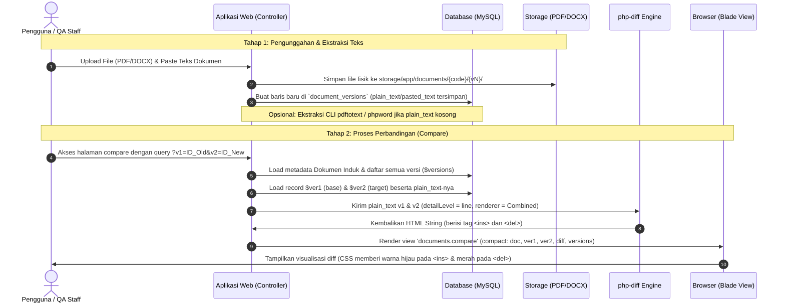

# DOCUMENT DIFF FORENSIC & UI MODERNIZATION REVIEW
**Project:** Library-ISO — PT Peroni Karya Sentra  
**Date of Audit:** June 19, 2026  
**Auditor:** Antigravity (Advanced Agentic Coding AI)

---

## Executive Summary
Laporan ini menyajikan audit forensik mendalam terhadap arsitektur perbandingan (*compare engine*) dokumen dan mesin versioning di aplikasi `Library-ISO`. Laporan ini mengevaluasi jalur aliran data saat ini, membedah prioritas sumber data, menilai kualitas antarmuka (UI/UX) compare yang ada, serta mengajukan proposal desain UI modern (Fase 2) untuk kebutuhan audit ISO 9001:2015, review RTM, Direktur, dan Management Representative (MR).

---

## PHASE 1 — FORENSIC REVIEW

### A. Arsitektur Compare Saat Ini

Sistem perbandingan membandingkan perbedaan isi teks antara dua versi dokumen secara asinkron/sinkron berbasis web.

#### 1. Komponen Utama
* **Route Compare:** 
  `/documents/{document}/compare` (Name: `documents.compare`), bertipe `GET` di mana ID dokumen dikirim sebagai parameter URL, sedangkan versi dasar (`v1`) dan versi target (`v2`) dikirim sebagai parameter query string (`?v1=X&v2=Y`).
* **Controller Action:**
  `DocumentController@compare` yang bertugas memvalidasi keberadaan dokumen dan versi, memilah parameter input, memuat teks konten dari database, memanggil mesin diff, dan mengembalikan view Blade.
* **View Blade:**
  `resources/views/documents/compare.blade.php`, menggunakan layout admin QC (`layouts.iso`) dan merender HTML diff hasil kalkulasi di dalam tag `<pre class="diff-output">`.
* **Diff Package:**
  `jfcherng/php-diff` (versi `^6.16`), diintegrasikan melalui helper `DocumentController::buildDiff()`.
* **Sumber Data Diff:**
  Kolom `plain_text` dan `pasted_text` pada tabel `document_versions` di database.

#### 2. Diagram Alur Data Lengkap (Data Lifecycle Flow)



---

### B. Audit Versioning Engine

Sistem menggunakan model relasional terdistribusi untuk mencatat riwayat perubahan dokumen.

#### Skenario 1: Dokumen baru dibuat (v1)
Saat dokumen dengan kode `IK.QA.01` pertama kali didaftarkan:
* **Tabel `documents`:** Tersimpan metadata utama (doc_code, title, department_id, dll).
  * Jika diterbitkan langsung (**Publish**): `current_version_id` diisi menunjuk ke ID versi pertama, `revision_number = 1`, `revision_date = now()`.
  * Jika disimpan sebagai draf (**Save Draft**): `current_version_id` bernilai `NULL`, `revision_number = 0`.
* **Tabel `document_versions`:** Dibuat satu baris untuk versi `v1`.
  * Kolom `plain_text` & `pasted_text` diisi dengan teks dokumen.
  * Kolom `checksum` diisi hash SHA-256 dari file PDF yang diunggah.
  * `status` diisi `'approved'` (jika Publish) atau `'draft'` (jika Save Draft).
  * `prev_version_id` bernilai `NULL`.

#### Skenario 2: Upload revisi (v1 → v2)
Saat pengguna melakukan revisi dari `v1` menjadi `v2`:
* **Apa yang berubah?**
  * Dibuat baris baru di tabel `document_versions` untuk `v2` dengan `version_label = 'v2'`, `status = 'draft'`, `approval_stage = 'KABAG'`.
  * Ketika `v2` disetujui oleh Direktur: `current_version_id` pada tabel `documents` diperbarui mengarah ke ID `v2`, dan `revision_date` diperbarui.
* **Apa yang tetap disimpan?**
  * Baris database `v1` di tabel `document_versions` tetap utuh (tidak dihapus).
  * Riwayat approval log `v1` di tabel `approval_logs` tetap dipertahankan.
* **Apakah file lama masih ada?**
  * Ya. File fisik `v1` (`file_path`, `pdf_path`, `master_path`) tetap tersimpan di storage: `storage/app/documents/IK.QA.01/v1/`.
* **Apakah text lama masih ada?**
  * Ya. Teks plain teks `v1` tetap tersimpan secara permanen pada database kolom `plain_text` baris `v1` sehingga perbandingan historis tetap dapat dilakukan kapan saja.

#### Skenario 3: Upload revisi lagi (v1 → v2 → v3)
* **Bisakah perbandingan v1 vs v3 dilakukan?**
  * **Bisa.** Karena `v1` dan `v3` disimpan sebagai record independen di tabel `document_versions` yang masing-masing memiliki data `plain_text` sendiri.
  * **Hambatan/Batasan saat ini:**
    * Di tingkat database, kolom `prev_version_id` pada versi `v3` seharusnya menunjuk ke `v2`, dan `v2` menunjuk ke `v1` (membentuk linked-list). Namun karena `prev_version_id` hanya diisi melalui CLI command `documents:build-relations` dan dibiarkan `NULL` saat pembuatan lewat web, sistem tidak bisa mengetahui suksesi versi secara dinamis di runtime tanpa mengurutkan berdasarkan ID/waktu pembuatan.
    * Untungnya, controller `DocumentController@compare` menggunakan pendekatan koleksi (`orderByDesc('id')`), sehingga perbandingan antara dua ID mana pun tetap didukung selama kedua ID versi tersebut dikirim lewat query parameter.

---

### C. Audit Data Source (Prioritas Sumber Data)

> [!IMPORTANT]
> **Jawaban Pasti:**
> Diff engine **TIDAK PERNAH** membaca file fisik (`DOCX`, `XLSX`, atau `PDF`) secara langsung di runtime saat halaman compare diakses. Diff engine **100% membaca data dari database** (kolom `plain_text` dan `pasted_text`).

#### Urutan Prioritas Pembacaan Data Konten untuk Diff (berdasarkan source code):
Di dalam controller `DocumentController.php` baris 591-594:
```php
$text1 = $ver1->plain_text ?: ($ver1->pasted_text ?: '(Tidak ada teks)');
$text2 = $ver2->plain_text ?: ($ver2->pasted_text ?: '(Tidak ada teks)');
```
1. **`plain_text` (Prioritas 1):** Kolom database tempat penyimpanan teks terekstraksi. Jika kolom ini memiliki isi, data ini yang langsung dipakai.
2. **`pasted_text` (Prioritas 2 / Fallback):** Jika `plain_text` kosong/null, sistem akan menggunakan teks yang ditempel manual oleh pengguna di kolom `pasted_text`.
3. **`"(Tidak ada teks)"` (Prioritas 3 / Default):** Jika kedua kolom di database kosong, sistem menggunakan string default ini sebagai bahan perbandingan agar engine tidak crash.

---

### D. Audit UI Compare Saat Ini

Penilaian kegunaan antarmuka perbandingan versi yang berjalan saat ini:

#### 1. Apa yang Sudah Bagus (Kekuatan)
* Dropdown pemilihan versi otomatis terisi sesuai daftar versi yang ada pada dokumen.
* Adanya JavaScript untuk meminimalkan error pemilihan ganda (validasi `v1 !== v2`).
* Deteksi default versi (auto-select) cerdas menggunakan JS pada client-side (memilih approved terbaru sebagai base dan draft terbaru sebagai target).

#### 2. Apa yang Masih Buruk (Kelemahan)
* **Tampilan Teknis (Developer-Centric):** Output perbandingan disajikan di dalam tag `<pre>` mentah tanpa spasi paragraf atau tabel terformat, membuatnya sangat melelahkan untuk dibaca oleh Direktur/Auditor.
* **Ketiadaan Metadata Kontekstual:** Halaman compare tidak menampilkan ringkasan alasan perubahan (*change note*), tanggal disetujui, ataupun siapa pengunggah masing-masing versi secara jelas di header komparasi.
* **Absennya Ringkasan Perubahan:** Pengguna tidak tahu berapa banyak kata/baris yang ditambahkan, dihapus, atau dimodifikasi tanpa menghitungnya secara manual di dokumen.

#### 3. Penilaian Skor (Skala 1 - 10)

* **Audit Readability:** **5 / 10**  
  *Alasan:* Teks bertumpuk rapat tanpa format paragraf asli, font monospace terlalu kecil.
* **Visual Hierarchy:** **4 / 10**  
  *Alasan:* Layout form seleksi sangat kaku, box perbandingan dominan memenuhi layar tanpa pembagian area visual yang rapi.
* **UX (User Experience):** **4 / 10**  
  *Alasan:* Setiap perubahan dropdown memaksa reload seluruh halaman secara sinkron tanpa loader indikator yang elegan.
* **ISO Usability:** **4 / 10**  
  *Alasan:* Kurangnya keterkaitan informasi persetujuan (approval logs) pada versi yang sedang dibanding-bandingkan.
* **Director Usability:** **3 / 10**  
  *Alasan:* Direktur membutuhkan summary ringkas dan eksekutif (misal: "Dokumen ini diubah pada poin 2.3 tentang SPECTRO"), bukan file dump teks mentah.
* **MR (Management Representative) Usability:** **4 / 10**  
  *Alasan:* MR kesulitan melacak alasan perubahan (*change notes*) langsung pada layar komparasi.

---

## PHASE 2 — UI MODERNIZATION PLAN (PROPOSAL)

Berikut adalah proposal pembaruan desain antarmuka halaman Compare Version agar lebih elegan, profesional, dan siap audit.

### 1. Mockup Tekstual Tata Letak Baru (UI Wireframe)

```text
+-----------------------------------------------------------------------------------------+
|  [Logo] LIBRARY-ISO | PT PERONI KARYA SENTRA                                            |
+-----------------------------------------------------------------------------------------+
|  <- Kembali ke Dokumen                                                                  |
|                                                                                         |
|  DOCUMENT INFORMATION (Header Dokumen)                                                  |
|  Code   : IK.GUD-BHN.01           | Title           : Prosedur Penerimaan Bahan Baku    |
|  Dept   : Quality Control         | Current Version : v2 Approved (10 May 2026)         |
+-----------------------------------------------------------------------------------------+
|                                                                                         |
|  COMPARE CONFIGURATION & VERSION HISTORY                                                |
|  +-------------------------------------+ +--------------------------------------------+ |
|  | SELECT VERSIONS                     | | VERSION HISTORY                            | |
|  |                                     | | v3 [Draft]      18 Jun 2026  (Andi)        | |
|  | Base (Older):  [ v1 - Approved   v] | | v2 [Approved]   10 May 2026  (Budi)        | |
|  | Target (New):  [ v3 - Draft      v] | | v1 [Approved]   01 Jan 2026  (Admin)       | |
|  |                                     | |                                            | |
|  | [ Compare Now ]                     | | *Klik label untuk memilih versi komparasi  | |
|  +-------------------------------------+ +--------------------------------------------+ |
|                                                                                         |
|  METADATA COMPARISON CARD                                                               |
|  +-------------------------------------+ +--------------------------------------------+ |
|  | BASE VERSION (v1)                   | | TARGET VERSION (v3)                        | |
|  | Status     : Approved               | | Status     : Draft                         | |
|  | Approved   : 01 Jan 2026            | | Created    : 18 Jun 2026                   | |
|  | Signee     : Admin QC               | | Uploader   : Andi (QA Staff)               | |
|  | Change Note: Baseline upload        | | Change Note: Tambah metode radiasi Spectro | |
|  +-------------------------------------+ +--------------------------------------------+ |
|                                                                                         |
|  REVISION SUMMARY (Ringkasan Perubahan)                                                 |
|  +--------------------+  +--------------------+  +--------------------+                 |
|  |   Added Words      |  |   Removed Words    |  |   Total Changes    |                 |
|  |      + 186         |  |       - 24         |  |        210         |                 |
|  |   [Green Badge]    |  |    [Red Badge]     |  |    [Blue Badge]    |                 |
|  +--------------------+  +--------------------+  +--------------------+                 |
|                                                                                         |
|  COMPARE VISUALIZATION (Diff Output)                                                    |
|  +------------------------------------------------------------------------------------+ |
|  |  STANDAR OPERASIONAL PROSEDUR                                                      | |
|  |  BAGIAN 2: PENGECEKAN BAHAN BAKU                                                   | |
|  |  2.1. Memeriksa kondisi bahan baku secara visual.                                  | |
|  |  [+] 2.2. Melakukan proses pemeriksaan bahan baku dari efek radiasi... [/-]        | |
|  |  [-] 2.3. Memeriksa bahan baku dengan menggunakan Handheld... [/-]                 | |
|  |  [+] 2.3. Memeriksa bahan baku dengan menggunakan Spectrometer... [/-]              | |
|  +------------------------------------------------------------------------------------+ |
+-----------------------------------------------------------------------------------------+
```

---

### 2. Penjelasan Detail Sub-Komponen

#### A. Compare Header
Panel ini diletakkan di bagian paling atas dengan background putih bersih, bayangan tipis, dan border rounded. Panel ini menampilkan informasi ringkas dokumen induk agar auditor langsung mengenali subjek pemeriksaan:
* **Code:** `doc_code` (font tebal, uppercase).
* **Title:** `title` (text-lg).
* **Department:** Nama departemen terkait (didapat lewat relasi `$doc->department->name`).
* **Current Version:** Informasi versi aktif saat ini.

#### B. Metadata Comparison Card
Dua kartu diletakkan berdampingan secara horizontal (*side-by-side*) untuk membandingkan metadata versi `v1` vs `v2`. Kartu ini penting karena memberikan konteks *siapa*, *kapan*, dan *mengapa* dokumen tersebut direvisi:
* **Kiri (Base):** Berisi Label Versi, Status, Tanggal Persetujuan/Pembuatan, Nama Penyetuju/Pembuat, dan Catatan Revisi (`change_note`).
* **Kanan (Target):** Informasi yang sama untuk versi target pembanding.

#### C. Revision Summary (Statistik Perubahan)
Menampilkan tiga kartu mini berisi statistik perubahan teks. Statistik ini dihitung secara dinamis dari string HTML diff yang dihasilkan oleh package `jfcherng/php-diff` menggunakan parser PHP sederhana:
* **Logic Perhitungan:**
  * **Added (Penambahan):** Dihitung dari jumlah tag `<ins>` di dalam HTML diff.
    ```php
    $addedCount = substr_count($diff, '<ins>');
    ```
  * **Removed (Penghapusan):** Dihitung dari jumlah tag `<del>` di dalam HTML diff.
    ```php
    $removedCount = substr_count($diff, '<del>');
    ```
  * **Total Changes:** Jumlah dari `$addedCount + $removedCount`.
* Kartu ini didesain dengan angka besar berbalut warna pastel yang harmonis (hijau untuk penambahan, merah untuk penghapusan, biru untuk total).

#### D. Improved Highlight Design (CSS Pembaruan)
Desain highlight saat ini digantikan dengan skema warna yang lebih premium, kontras tinggi namun lembut di mata, serta menggunakan border pembatas untuk meningkatkan kejelasan audit.

##### Kode CSS yang Diusulkan:
```css
/* Container Utama Diff */
.diff-container {
    background-color: #f8fafc;
    border: 1px solid #e2e8f0;
    border-radius: 0.75rem;
    padding: 1.5rem;
    font-family: 'Inter', ui-monospace, SFMono-Regular, monospace;
    font-size: 0.875rem;
    line-height: 1.7;
    color: #334155;
    white-space: pre-wrap;
    word-wrap: break-word;
}

/* Sorotan untuk Penambahan Teks (Insertions) */
ins {
    background-color: #dcfce7; /* Hijau pastel lembut */
    color: #15803d;            /* Teks hijau tua */
    text-decoration: none;
    padding: 0.125rem 0.25rem;
    border-radius: 0.25rem;
    font-weight: 500;
    border-bottom: 2px solid #86efac;
}

/* Sorotan untuk Penghapusan Teks (Deletions) */
del {
    background-color: #fee2e2; /* Merah pastel lembut */
    color: #b91c1c;            /* Teks merah tua */
    text-decoration: line-through;
    padding: 0.125rem 0.25rem;
    border-radius: 0.25rem;
    font-weight: 500;
    border-bottom: 2px solid #fca5a5;
}
```

---

## RECOMMENDATION & PRIORITIZED ROADMAP (PHASE 2)

Jika proposal ini disetujui, pengerjaan modernisasi UI Compare ini akan dibagi menjadi 3 prioritas:

1. **Prioritas 1: Implementasi Layout Grid, Header & Metadata Card (UX Baseline)**
   * Mengatur ulang halaman `compare.blade.php` agar menggunakan grid dua kolom (Kiri: Metadata & Form Filter, Kanan: Version History & Ringkasan).
   * Menampilkan detail pengunggah, tanggal, dan catatan revisi per versi.
2. **Prioritas 2: Penerapan Desain CSS Highlight Baru & Revision Summary (Readability & Metrics)**
   * Memasang CSS premium untuk tag `<ins>` dan `<del>`.
   * Menghitung statistik penambahan/penghapusan teks di controller lalu menampilkannya pada statistik card.
3. **Prioritas 3: Refaktorisasi Diff Engine ke Mode Word-by-Word (Quality Optimization)**
   * Mengubah detail level perbandingan dari `'line'` ke `'word'` di controller untuk presisi sorotan kata yang optimal.
