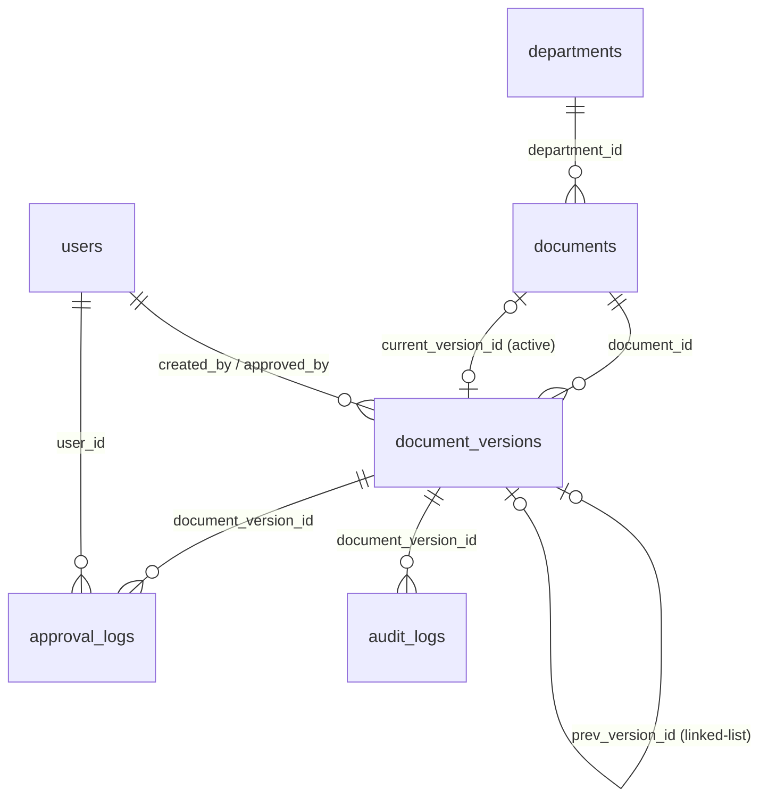

# DOCUMENT VERSIONING & DIFF ENGINE FORENSIC REPORT
**Project:** Library-ISO — PT Peroni Karya Sentra  
**Date of Audit:** June 19, 2026  
**Auditor:** Antigravity (Advanced Agentic Coding AI)

---

## Executive Summary
This report presents a forensic architectural audit of the document versioning system and diff engine in the `Library-ISO` application. The audit was conducted to understand the current implementation, identify inconsistencies, and trace the root cause of the `Undefined variable $versions` error on the `/documents/{id}/compare` page. No code modifications were performed during this audit; all findings are based strictly on codebase analysis.

---

## 1. Arsitektur Versioning Saat Ini

Sistem versioning dirancang dengan model relasional *one-to-many* antara dokumen induk dan versinya, didukung dengan data relasi *linked-list* antar-versi (*previous/next version*).

### A. Tabel Database Terkait
1. **`documents`**
   * **Fungsi:** Menyimpan data induk/metadata utama dokumen (seperti Kode Dokumen, Judul, Departemen, Kategori, Status Keaktifan).
   * **Kolom Kunci:** `current_version_id` (foreign key ke `document_versions.id` untuk menentukan versi aktif/publik).
2. **`document_versions`**
   * **Fungsi:** Menyimpan data fisik, plain text, status persetujuan, dan riwayat revisi dari setiap versi dokumen.
   * **Kolom Kunci:** 
     * `document_id` (foreign key ke `documents.id`)
     * `prev_version_id` (self-referencing foreign key ke `document_versions.id` untuk menunjuk versi sebelumnya)
3. **`approval_logs`**
   * **Fungsi:** Menyimpan jejak persetujuan multi-stage (`submit`, `approve`, `reject`) per versi dokumen.
   * **Kolom Kunci:** `document_version_id` (foreign key ke `document_versions.id`), `user_id` (foreign key ke `users.id`).
4. **`audit_logs`**
   * **Fungsi:** Log aktivitas audit sistem (misal: `create_baseline_publish`, `create_replace_draft`, `reject_version`, `download_master`).

### B. Hubungan `current_version_id` & `prev_version_id`
* **`current_version_id` (`documents` → `document_versions`):**
  * Menandakan versi mana yang saat ini diterbitkan dan berlaku (*active/published baseline*).
  * Diperbarui ketika Direktur/Admin menyetujui versi dokumen baru melalui flow approval.
  * Di dalam model `Document`, relasi `currentVersion()` didefinisikan menggunakan Laravel's `latestOfMany()` (`$this->hasOne(DocumentVersion::class)->latestOfMany()`), yang berarti query Eloquent relasi ini sebenarnya mengabaikan kolom `current_version_id` di database dan langsung mengambil baris versi terbaru di tabel `document_versions`. Ini merupakan inkonsistensi desain.
* **`prev_version_id` (`document_versions` → `document_versions`):**
  * Membentuk struktur data **Linked-List**. Setiap baris versi menunjuk langsung ke ID versi sebelumnya.
  * **PENTING:** Kolom `prev_version_id` **tidak pernah diisi secara otomatis** oleh Controller maupun Model saat membuat versi baru via Web UI. Relasi ini hanya terbentuk jika administrator menjalankan perintah CLI:
    ```bash
    php artisan documents:build-relations
    ```
    Tanpa perintah ini dijalankan, seluruh versi dokumen baru di database akan memiliki `prev_version_id` bernilai `NULL`. Oleh karena itu, di tingkat runtime aplikasi web, versi-versi dokumen tersebut hanyalah berupa kumpulan versi (*collection*) tanpa keterkaitan urutan formal selain dari ID/waktu pembuatan.

### C. Diagram Hubungan Antar Tabel (Entity Relationship Diagram)



---

## 2. Workflow Dokumen dari v1 sampai vN

### Skuario A: Pembuatan Dokumen Baru (Baseline / v1)
Ketika dokumen baru (misal: `IK.QA.01`) dibuat pertama kali di sistem:
1. **Apakah langsung dibuat sebagai v1?** 
   Ya. Secara default, sistem memanggil helper `nextVersionLabelForDocument` yang mendeteksi nomor versi tertinggi. Jika belum ada, sistem akan membuat label `v1`.
2. **Apakah ada konsep v0?** 
   Tidak ada konsep `v0`. Semua dokumen dimulai langsung dari `v1`.
3. **Kapan row `document_versions` pertama dibuat?**
   Dibuat bersamaan dengan pembuatan baris di tabel `documents`.
   * Jika opsi yang dipilih adalah **"Publish"**: Row `document_versions` dibuat dengan `status = 'approved'`, `approval_stage = 'DONE'`, dan `current_version_id` di tabel `documents` langsung diisi mengarah ke versi tersebut.
   * Jika opsi yang dipilih adalah **"Save as Draft"**: Row `document_versions` dibuat dengan `status = 'draft'`, `approval_stage = 'KABAG'`, dan `current_version_id` di tabel `documents` dibiarkan `NULL`.

---

### Skenario B: Dokumen Direvisi (v1 → v2)
Ketika versi `v1` sudah disetujui/aktif dan pengguna mengunggah revisi baru menjadi `v2`:
1. **Apakah file lama tetap disimpan?**
   Ya. File PDF (`pdf_path` / `file_path`) dan file Word/Excel (`master_path`) versi `v1` tetap utuh di storage fisik (`storage/app/documents/IK.QA.01/v1/`). Versi `v2` akan disimpan pada folder terpisah (`storage/app/documents/IK.QA.01/v2/`).
2. **Apakah plain_text lama tetap disimpan?**
   Ya. Plain text versi `v1` tersimpan secara permanen pada kolom `plain_text` di baris database `v1` di tabel `document_versions`.
3. **Apakah checksum lama tetap disimpan?**
   Ya. Kolom `checksum` pada baris `v1` tetap mempertahankan hash SHA-256 file PDF versi `v1` untuk integritas data.
4. **Apakah approval history lama tetap disimpan?**
   Ya. Seluruh log approval versi `v1` tersimpan aman di tabel `approval_logs` karena log tersebut ditautkan menggunakan `document_version_id`.

**Inkonsistensi Status:** 
Saat `v2` disetujui oleh Direktur, status versi `v1` **tidak diubah** menjadi `superseded` di runtime. Hal ini terjadi karena:
* Controller (`ApprovalController@approve`) langsung meng-update status `v2` menjadi `approved` dan memperbarui `current_version_id` dokumen induk, tanpa mengubah status versi lama.
* Fungsi `approveByDirector` di model `DocumentVersion` yang bertugas mengubah status versi lama menjadi `superseded` **tidak pernah dipanggil** oleh Controller mana pun.
* Akibatnya, baik `v1` maupun `v2` akan sama-sama memiliki status `'approved'` di tabel `document_versions`.

---

### Skenario C: Dokumen Direvisi Lagi (v1 → v2 → v3)
Jalur penyimpanan data pada setiap tahap:

| Tahap | State Tabel `documents` | State Tabel `document_versions` | State Tabel `approval_logs` |
| :--- | :--- | :--- | :--- |
| **Tahap 1 (v1 Approved)** | `current_version_id` = `ID_v1`<br>`revision_number` = 1 | Row 1 (`v1`): status = `approved`<br>stage = `DONE`<br>`prev_version_id` = `NULL` | Log submit & approve untuk `v1` |
| **Tahap 2 (v2 Draft)** | `current_version_id` = `ID_v1`<br>`revision_number` = 1 | Row 1 (`v1`): status = `approved`<br>Row 2 (`v2`): status = `draft`<br>stage = `KABAG`<br>`prev_version_id` = `NULL` (runtime) | Log submit & approve untuk `v1` |
| **Tahap 3 (v2 Approved)** | `current_version_id` = `ID_v2`<br>`revision_number` = 2 *(jika lewat DocumentController)* | Row 1 (`v1`): status = `approved`<br>Row 2 (`v2`): status = `approved`<br>stage = `DONE`<br>`prev_version_id` = `NULL` (runtime) | Log submit & approve untuk `v1`<br>Log submit & approve untuk `v2` |
| **Tahap 4 (v3 Approved)** | `current_version_id` = `ID_v3`<br>`revision_number` = 3 | Row 1 (`v1`): status = `approved`<br>Row 2 (`v2`): status = `approved`<br>Row 3 (`v3`): status = `approved`<br>stage = `DONE` | Log approval lengkap untuk `v1`, `v2`, dan `v3` |

---

## 3. Cara Kerja Diff Engine

Diff engine bertanggung jawab untuk membandingkan perbedaan teks antara dua versi dokumen dan menyoroti perubahan tersebut secara visual.

### A. Algoritma & Package
* **Package Pihak Ketiga:** Menggunakan package Composer **`jfcherng/php-diff`** (versi `^6.16`).
* **Format Perbandingan:** Berbasis **Line-by-Line**.
  * Konfigurasi di controller: `'detailLevel' => 'line'`. Hal ini berarti perbandingan dilakukan baris demi baris, bukan kata demi kata (*word-by-word*) atau karakter demi karakter (*char-by-word*).
* **Renderer:** Menggunakan renderer `'Combined'`, yang menghasilkan HTML gabungan berisi teks asli dengan tag `<ins>` (untuk penambahan) dan `<del>` (untuk penghapusan).

### B. Cara Menghasilkan Sorotan Warna (Highlighting)
Perbedaan warna dihasilkan melalui CSS minimal yang dideklarasikan di dalam file `compare.blade.php`:
```css
ins { background-color: #d1fae5; text-decoration: none; } /* Hijau untuk penambahan */
del { background-color: #fee2e2; text-decoration: none; } /* Merah untuk penghapusan */
```
Ketika HTML hasil render dari `DiffHelper::calculate` ditampilkan, tag `<ins>` akan mendapat background hijau lembut, dan `<del>` mendapat background merah lembut.

### C. Sumber Data Teks
Diff engine membandingkan teks yang diambil dari kolom:
1. `plain_text` (prioritas utama)
2. `pasted_text` (fallback jika `plain_text` kosong)
3. Jika keduanya kosong, diff engine menampilkan teks bawaan: `"(Tidak ada teks)"`.

**Mekanisme Pengisian Teks:**
* **Manual (Pasted Text):** Saat mengunggah/mengedit versi via Web UI, pengguna dapat menempelkan teks dokumen ke kolom input. Teks ini langsung disimpan ke kolom `pasted_text` dan `plain_text`.
* **Otomatis (CLI Extraction):** Teks dari file PDF atau Word (`.docx`) diekstraksi melalui perintah artisan `documents:extract-text` menggunakan `Smalot\PdfParser` atau `PhpOffice\PhpWord`. Perintah `reextract:versions` juga dapat memanggil CLI `pdftotext` atau `LibreOffice soffice` untuk konversi.

---

## 4. Kemampuan Compare Aktual (Teoretis vs Praktis)

Berdasarkan implementasi kode saat ini, berikut adalah analisis kemampuan pembandingan antar-versi dokumen:

* **Kasus 1: v1 dibandingkan dengan v2** — **Didukung.**
* **Kasus 2: v2 dibandingkan dengan v3** — **Didukung.**
* **Kasus 3: v1 dibandingkan dengan v3** — **Didukung.**
* **Kasus 4: v1 dibandingkan dengan v5** — **Didukung.**
* **Kasus 5: Semua versi ditampilkan dalam dropdown lalu user bebas memilih dua versi mana pun.**
  * **Apakah arsitektur saat ini memungkinkan secara teoretis?** 
    Ya. Secara database dan logika model, semua versi disimpan di tabel `document_versions` dengan relasi `document_id`. Sehingga secara teoretis, controller dapat memuat semua versi dan diff engine dapat membandingkan dua ID versi mana pun yang dikirimkan.
  * **Apa yang membatasi secara praktis saat ini?**
    Ada batasan kritis pada implementasi controller dan view:
    1. **Kesalahan Nama Query Parameter:** Controller mencari array parameter bernama `versions` (misal: `?versions[]=10&versions[]=12`), sedangkan form pada view mengirimkan parameter individual bernama `v1` dan `v2` (misal: `?v1=10&v2=12`). Hal ini membuat pilihan dropdown user selalu diabaikan dan sistem selalu memaksa menampilkan perbandingan dua versi terbaru.
    2. **Variable Mismatch (Bug Utama):** View memanggil `@foreach($versions as $ver)` untuk merender pilihan dropdown, tetapi controller tidak pernah mengirimkan variabel `$versions` tersebut ke view.

---

## 5. Root Cause Error Compare Saat Ini

Ketika mengakses `/documents/{id}/compare`, aplikasi melempar error:
`ErrorException - Undefined variable $versions` di `resources/views/documents/compare.blade.php:23`.

Berikut analisis forensik penyebab masalah ini:

1. **Overwriting Variabel Lokal di Controller:**
   Di dalam `DocumentController@compare`, variabel `$versions` dideklarasikan untuk menampung array ID versi hasil filter dari request query:
   ```php
   $versions = collect($request->query('versions', []))
       ->flatten()
       ->map(...)
       ->all();
   ```
   Ini menimpa penamaan variabel yang seharusnya digunakan untuk mengirimkan koleksi objek `DocumentVersion` ke view.
2. **Tidak Dikirim ke View (View Compact Mismatch):**
   Controller memanggil fungsi `compact` untuk mengirim data ke view:
   ```php
   return view('documents.compare', compact('doc', 'ver1', 'ver2', 'diff', 'selectedVersions'));
   ```
   Variabel `$versions` (baik yang berisi ID query maupun objek versi dokumen) **tidak dimasukkan** ke dalam pemanggilan `compact()`.
3. **View Mengharapkan Koleksi Versi:**
   Di file `compare.blade.php` pada baris 23 dan 37, terdapat perulangan `@foreach($versions as $ver)`. Karena variabel `$versions` tidak dikirim oleh controller, Blade melemparkan error `Undefined variable`.
4. **Discrepancy Input Parameter Form:**
   Form di view menggunakan input select dengan name `v1` dan `v2`. Namun, Controller menulis logika untuk menangkap array `versions` (`$request->query('versions', [])`). Logika penanganan input query di controller tidak sinkron dengan struktur form di view.

---

## 6. Rekomendasi Desain Ideal untuk Library ISO PT Peroni Karya Sentra

Untuk meningkatkan skalabilitas, keandalan, dan kemudahan audit ISO 9001:2015, berikut adalah rekomendasi perbaikan desain versioning:

### A. Perbaikan Bug Jangka Pendek (Quick Fixes)
1. **Perbaiki Controller `DocumentController@compare`:**
   * Ambil daftar semua versi dari dokumen induk dan kirimkan ke view sebagai variabel `$versions`.
   * Ubah cara penanganan query parameter agar menangkap `v1` dan `v2` secara langsung (sesuai dengan nama input select pada form di view).
   * Contoh perbaikan logika:
     ```php
     $allVersions = $doc->versions()->orderByDesc('id')->get();
     
     $v1Id = $request->query('v1');
     $v2Id = $request->query('v2');
     
     if (!$v1Id || !$v2Id) {
         // Fallback ke 2 versi terbaru jika tidak diisi
         ...
     } else {
         $ver1 = DocumentVersion::findOrFail($v1Id);
         $ver2 = DocumentVersion::findOrFail($v2Id);
     }
     
     return view('documents.compare', [
         'doc' => $doc,
         'versions' => $allVersions, // Mengirim semua versi untuk dropdown
         'ver1' => $ver1,
         'ver2' => $ver2,
         'diff' => $diff,
         'selectedVersions' => [$ver1->id, $ver2->id]
     ]);
     ```

### B. Rekomendasi Arsitektur Jangka Panjang (Ideal Design)
1. **Otomatisasi Linked-List di Tingkat Database (`prev_version_id`):**
   * Jangan mengandalkan CLI command `documents:build-relations` untuk menghubungkan versi.
   * Gunakan Laravel **Model Observers** atau **booted event listener** pada `DocumentVersion`. Ketika versi baru dibuat, sistem harus mencari versi disetujui sebelumnya secara otomatis dan mengisi `prev_version_id` saat penyimpanan record baru.
2. **Implementasi Status `superseded` secara Konsisten:**
   * Di dalam event persetujuan akhir (final approval), sistem harus secara otomatis mengubah status versi aktif sebelumnya (versi yang ditunjuk oleh `current_version_id` sebelum update) dari `approved` menjadi `superseded`.
   * Hal ini penting agar hanya ada **satu** versi dengan status `approved` (atau aktif) di tabel `document_versions` untuk setiap dokumen induk pada satu waktu.
3. **Penyelarasan Relasi Eloquent:**
   * Ubah definisi `currentVersion()` pada model `Document` agar menggunakan relasi `belongsTo` yang memetakan langsung ke kolom `current_version_id`:
     ```php
     public function currentVersion(): BelongsTo
     {
         return $this->belongsTo(DocumentVersion::class, 'current_version_id');
     }
     ```
     Ini akan menjamin integrasi data yang konsisten antara apa yang tertulis di database dengan apa yang diakses melalui Eloquent ORM.
4. **Peningkatan Diff Engine (Word-by-Word):**
   * Dokumen ISO sering kali hanya mengalami perubahan kecil (seperti perubahan kata atau penomoran). Perbandingan berbasis baris (*line-by-line*) sering kali menyoroti seluruh baris/paragraf sebagai merah dan hijau meskipun hanya satu kata yang berubah.
   * Disarankan untuk mengubah konfigurasi `detailLevel` pada `jfcherng/php-diff` menjadi `'word'` agar sorotan warna lebih presisi pada kata yang berubah, yang akan memberikan pengalaman pengguna (UX) yang jauh lebih premium dan informatif.
5. **Otomatisasi Ekstraksi Teks (Background Queue Jobs):**
   * Pengguna tidak boleh dipaksa melakukan paste text secara manual saat upload hanya untuk menghindari beban ekstraksi teks.
   * Integrasikan library ekstraksi teks ke dalam **Laravel Queue Job**. Saat file PDF/Docx berhasil diunggah, antrean pekerjaan latar belakang (background job) akan berjalan secara asinkron untuk mengekstrak teks menggunakan `pdftotext` atau PHPWord, lalu memperbarui kolom `plain_text` tanpa memblokir request pengguna di browser.
