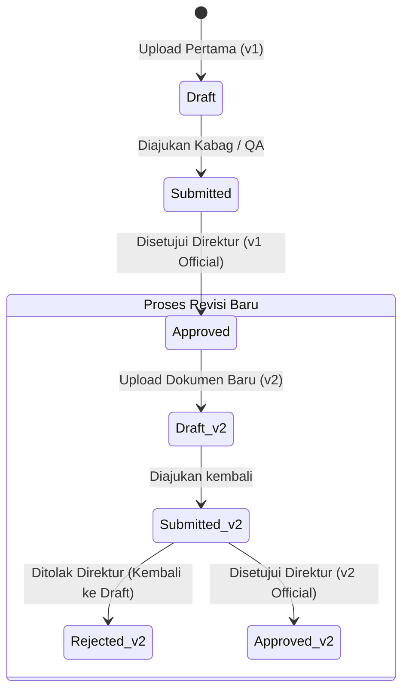
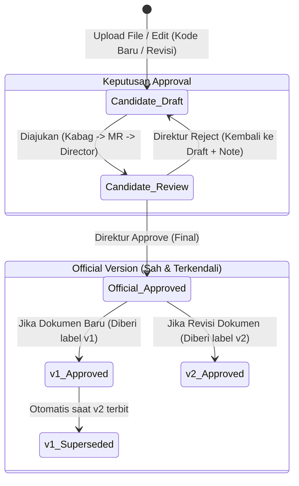

# ARCHITECTURAL REVIEW: DOCUMENT VERSIONING V2
**Project:** Library-ISO — PT Peroni Karya Sentra  
**Date:** June 19, 2026  
**Auditor:** Antigravity (Advanced Agentic Coding AI)

---

## 1. CURRENT STATE DIAGRAM (ARSTRUKTUR SAAT INI)

Pada sistem saat ini, **tidak ada pemisahan tabel** antara berkas versi resmi (*Official Version*) dan berkas draf rancangan (*Revision Candidate*). Keduanya disimpan di dalam tabel `document_versions` yang sama dan dibedakan hanya berdasarkan kolom `status`.


* **Karakteristik Utama:** Setiap kali pengguna membuat draf atau mengajukan revisi baru, sistem langsung mencatatnya di database sebagai record `DocumentVersion` dengan label versi berikutnya (misal: `v2`, `v3`) meskipun statusnya masih `draft` atau `rejected`.

---

## 2. DESIRED STATE DIAGRAM (WORKFLOW BISNIS YANG DIINGINKAN)

Pada workflow yang diinginkan, draf pengajuan revisi diperlakukan sebagai **Revision Candidate** (calon versi) yang berada di area kerja sementara, dan **TIDAK** langsung mendapat label versi resmi sampai ia disetujui secara final oleh Direktur.



---

## 3. GAP ANALYSIS TABLE

Berikut perbandingan teknis antara sistem berjalan saat ini dengan kebutuhan bisnis yang baru:

| Parameter | Implementasi Saat Ini (Current) | Workflow Bisnis Target (Desired) | Kesenjangan (Gap) |
| :--- | :--- | :--- | :--- |
| **Pemisahan Konseptual** | Draf/revisi langsung dibuat sebagai record versi di `document_versions`. | Draf adalah *Revision Candidate* sementara; versi resmi hanya yang disetujui. | Sistem mencampur data operasional draf dengan arsip versi mutlak. |
| **Penomoran Versi (Label)** | Label versi (`v1`, `v2`, `v3`) langsung disematkan saat draf revisi pertama kali diunggah. | Label versi baru diberikan secara resmi **setelah** disetujui Direktur. | Draf revisi yang ditolak tetap mengotori label versi berikutnya. |
| **Perbandingan (Compare)** | Membandingkan ID versi fisik mana saja yang terdaftar di database. | Membandingkan versi resmi aktif (`v1`) dengan calon revisi yang sedang diajukan. | Perlu parameter dropdown dinamis untuk membedakan target komparasi. |
| **Pembersihan Logika** | Draf yang ditolak tetap tersimpan selamanya di tabel `document_versions` sebagai `'rejected'`. | Draf yang ditolak dapat diperbaiki di tempat (draf tunggal di-update) lalu diajukan kembali. | Redundansi baris data draf gagal pada database. |

---

## 4. RISIKO TIMELINE V2 (VISUAL COMPARISON)

Jika linimasa versi (Timeline V2) langsung diimplementasikan menggunakan seluruh data di tabel `document_versions` saat ini, tampilannya akan sangat membingungkan pengguna dan auditor karena dipenuhi oleh draf gagal dan proses yang belum sah.

### A. Tampilan Timeline yang Mengotori (Unfiltered Timeline)
```text
( v1 Approved ) ──► ( v2 Draft ) ──► ( v2 Rejected ) ──► ( v2 Approved ) ──► ( v3 Draft )
  [01 Jan 2026]       [02 Jan 2026]     [03 Jan 2026]       [04 Jan 2026]       [05 Jan 2026]
  *Buku Sah*          *Salah Ketik*     *Ditolak Dir*       *Buku Sah Baru*     *Proses Edit*
```
> [!WARNING]
> **Temuan Audit:** Linimasa di atas **sangat melanggar prinsip ISO 9001 Document Control** karena menampilkan draf yang ditolak/sedang berjalan sebagai bagian dari riwayat dokumen resmi.

### B. Tampilan Timeline yang Patuh ISO 9001 (Clean Timeline)
```text
( v1 Superseded ) ───────────────────────────────► [ v2 Approved ] (Current Active)
  Released: 01 Jan 2026                             Released: 04 Jan 2026
  Author  : Admin                                   Author  : QA Staff
  Approved: Direktur                                Approved: Direktur
```
* **Keterangan:** Hanya menampilkan versi resmi yang pernah/sedang sah. Draf dan penolakan disembunyikan dari linimasa publik dan hanya dapat dilihat di log riwayat persetujuan internal (*internal audit trail*).

---

## 5. ISO BEST PRACTICE & COMPARE STRATEGY REVIEW

### A. ISO 9001:2015 Document Control Best Practice

* **Pendekatan A: Setiap unggahan membuat versi baru (Draft, Rejected, dll. masuk riwayat)**
  * *Pro:* Merekam seluruh jejak pengetikan staf QA secara detail.
  * *Contra:* Mengotori audit trail. Auditor eksternal tidak ingin melihat draf yang salah ketik; mereka hanya ingin melihat riwayat dokumen terkendali yang didistribusikan secara resmi.
* **Pendekatan B: Hanya approval final yang menciptakan versi resmi**
  * *Pro:* Bersih, patuh pada standar ISO, dan memisahkan dengan tegas antara dokumen sah dan draf kerja (*Work in Progress*).
  * *Contra:* Membutuhkan mekanisme penyimpanan draf sementara sebelum dipromosikan menjadi versi resmi.
* **Verdict ISO:** **Pendekatan B** adalah standar mutlak pengendalian dokumen.

### B. Compare Strategy

Untuk PT Peroni Karya Sentra, **Model 2 (Compare tersedia saat approval DAN history)** adalah satu-satunya pilihan operasional yang layak.
* **Alasan:** Manajemen Representative (MR) dan Direktur **wajib** melihat perbedaan (*diff highlights*) antara dokumen resmi yang sedang aktif saat ini dengan draf revisi baru (*Revision Candidate*) sebelum mereka mengklik tombol **Approve**. Tanpa fitur compare pada saat proses approval, Direktur akan menyetujui dokumen secara buta tanpa tahu apa yang diubah.

---

## 6. FUTURE ARCHITECTURE RECOMMENDATION

Berikut perbandingan analisis opsi arsitektur jangka panjang:

### OPTION A: Satu Tabel Tunggal (`document_versions`) dengan Strict Logical Filtering (Rekomendasi Utama)
Kita tetap menggunakan satu tabel `document_versions` yang sudah ada, namun menerapkan filter ketat di tingkat model scope:
* Draf dan status non-approved diklasifikasikan sebagai *Revision Candidate* dan disembunyikan dari timeline.
* Saat draf disetujui, statusnya berubah menjadi `'approved'` dan otomatis mendapatkan `version_label` resmi.

### OPTION B: Pemisahan Fisik Tabel (`document_versions` vs `document_revision_candidates`)
Membuat tabel baru khusus untuk draf pengajuan revisi yang sedang berjalan. Setelah disetujui Direktur, record dipindahkan/disalin ke tabel `document_versions`.

### Analisis Komparasi Opsi:

| Kriteria | OPTION A (Satu Tabel + Logical Scope) | OPTION B (Dua Tabel Terpisah) |
| :--- | :--- | :--- |
| **Kompleksitas** | **Rendah.** Cukup menambahkan global scopes / filter status. | **Tinggi.** Duplikasi schema untuk teks, path file, dan relasi. |
| **Effort Migrasi** | **0% (Tidak ada migrasi).** Struktur database tidak perlu diubah. | **Tinggi.** Perlu migrasi pemisahan data historis yang rumit. |
| **Dampak Diff Engine** | **Sangat Ringan.** Engine tetap membaca relasi model yang sama. | **Berat.** Harus menulis ulang query komparasi lintas tabel. |
| **Approval Workflow**| **Tidak Berubah.** Sistem transisi status yang ada tetap berjalan. | **Berat.** Perlu refaktorisasi seluruh controller approval. |
| **Audit Trail** | **Sangat Baik.** Semua log terhubung ke satu ID referensi versi. | **Rumit.** Relasi log terputus saat draf dipindah ke tabel resmi. |
| **Timeline V2** | **Sangat Mudah.** Cukup load versi dengan filter `whereIn('status', ['approved', 'superseded'])`. | **Mudah.** Cukup memuat seluruh record dari tabel official. |

---

## 7. FINAL VERDICT

> [!IMPORTANT]
> **Rekomendasi Akhir:** **Pilihlah OPTION A (Satu Tabel dengan Strict Logical Filtering).**
> Pendekatan ini memberikan nilai bisnis dan kepatuhan ISO yang sama persis dengan Option B, namun dengan risiko regresi 0% dan menghemat waktu pengerjaan secara signifikan.

### Langkah Kerja Menyambut B2 (Timeline UI) dengan Opsi A:
1. **Penyaringan Timeline:** Query untuk komponen Timeline V2 wajib menggunakan filter `whereIn('status', ['approved', 'superseded'])` agar linimasa bersih dari draf dan versi ditolak.
2. **Penyaringan Detail Dokumen:** Halaman `documents.show` hanya akan menampilkan versi berstatus `'approved'` sebagai dokumen terkendali aktif.
3. **Workspace Draf Sementara:** Tampilkan box khusus bertajuk *"Revision Work in Progress (Candidate)"* hanya jika terdapat versi berstatus `draft` atau `submitted` di bawah dokumen tersebut, lengkap dengan tombol *"Compare with Active version"*.
